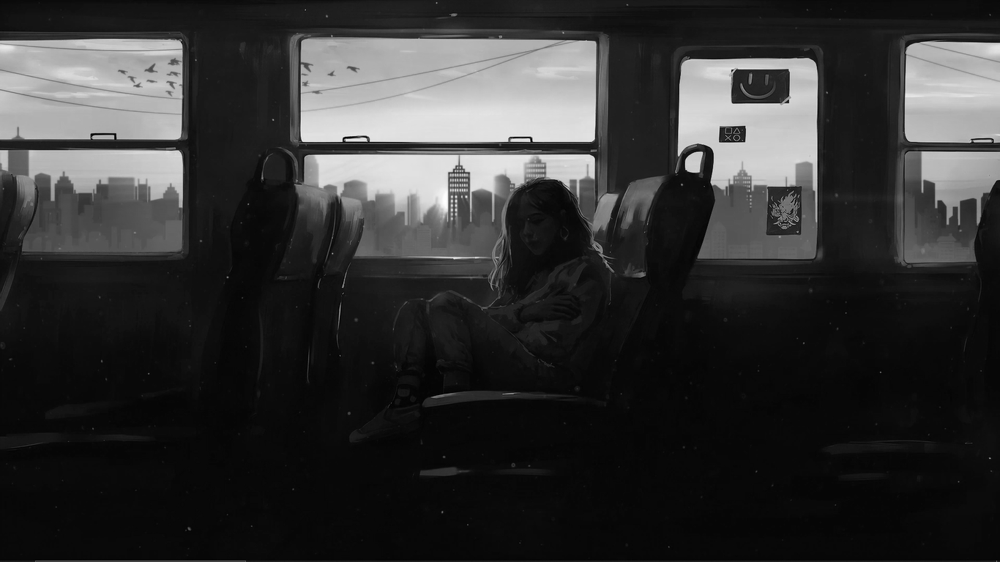
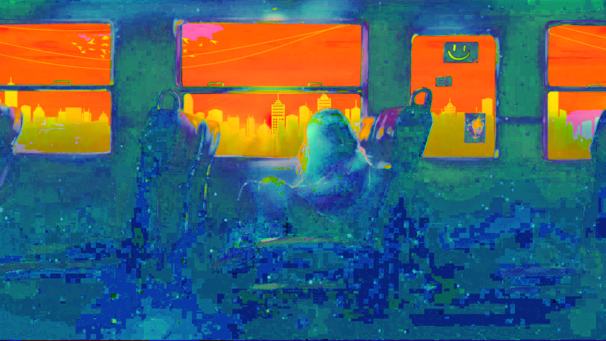
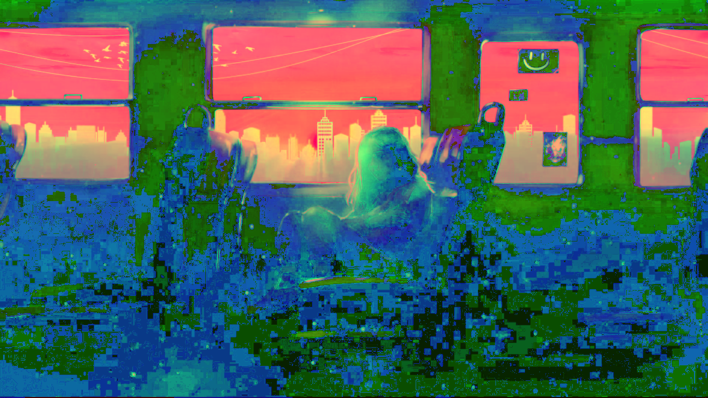
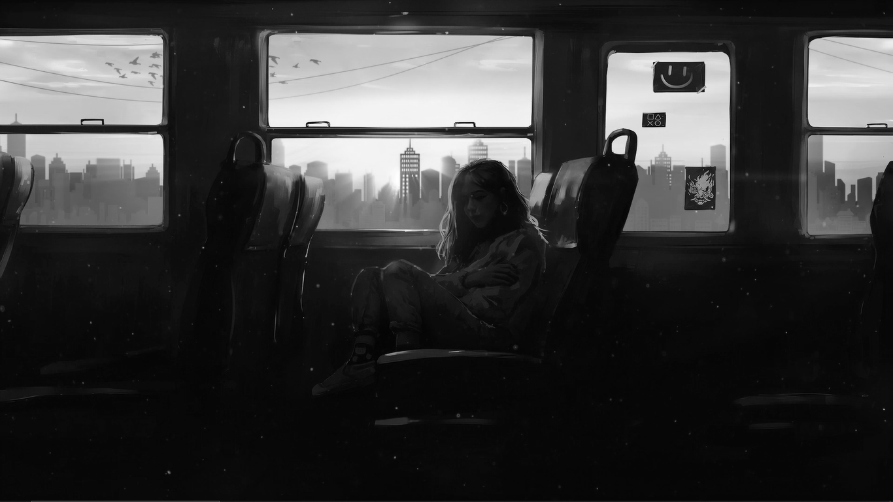
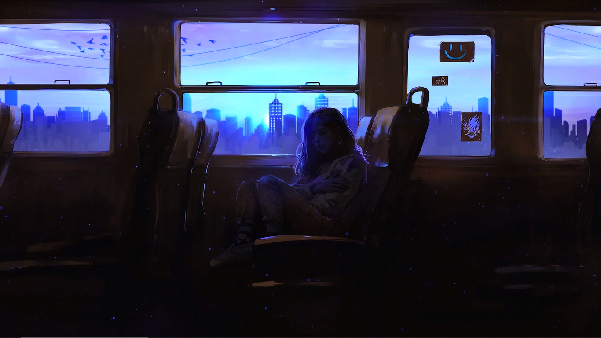
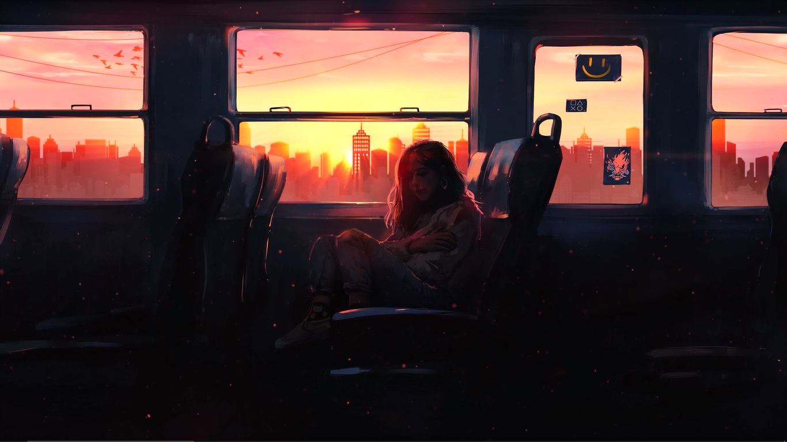
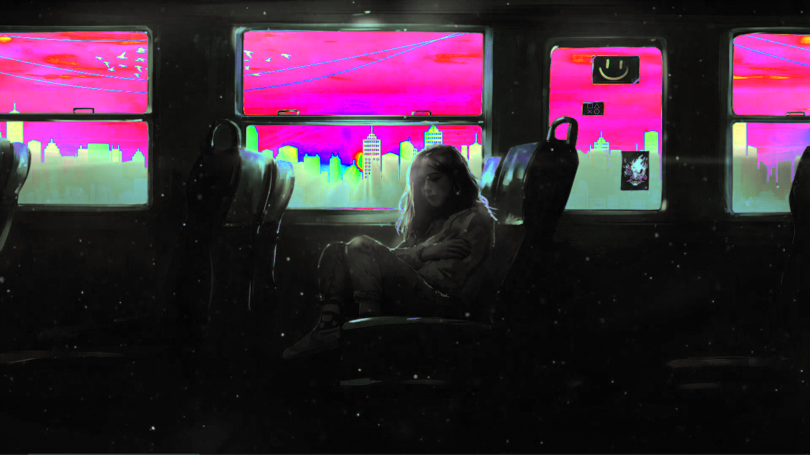

# <p align="center">Color Conversion</p>

## AIM
To perform the color conversion between RGB, BGR, HSV, and YCbCr color models.

## Software Required:
Anaconda - Python 3.7

## Algorithm:
### Step1:
Import cv2 library and upload the image or capture an image.

### Step2:
Read the saved image using cv2.imread("filename.jpg").

### Step3:
Convert the image into the given color transformation using cv2.cvtColor(image, cv2.BGR2YCrCb) 
and similarly for other color formats. 

### Step4:
Split and merge the image using cv2.split(hsv) and cv2.merge([h,s,v]) 

### Step5:
Output the image using cv2.imshow("OUTPUT", image)

## Program:
Developed By: ** SRIJITH R**
</br>
Register Number: **212221240054**
### i) Convert BGR and RGB to HSV and GRAY
```py
# Developed By: SRIJITH R
# Register Number: 212221240054

# i) Convert BGR and RGB to HSV and GRAY

import cv2
img = cv2.imread('girlintrain.png')
cv2.imshow('original',img)

bgr2hsv = cv2.cvtColor(img,cv2.COLOR_BGR2HSV)
cv2.imshow('BGR To HSV',bgr2hsv)

bgr2gray = cv2.cvtColor(img,cv2.COLOR_BGR2GRAY)
cv2.imshow('BGR To GRAY',bgr2gray)

rgb2hsv = cv2.cvtColor(img,cv2.COLOR_RGB2HSV)
cv2.imshow('RGB2HSV',rgb2hsv)

rgb2gray = cv2.cvtColor(img,cv2.COLOR_RGB2GRAY)
cv2.imshow('RGB2GRAY',rgb2gray)

cv2.waitKey(0)
cv2.destroyAllWindows()
```
### ii) Convert HSV to RGB and BGR
```py
cv2.imshow('HSV',bgr2hsv)

hsv2rgb = cv2.cvtColor(bgr2hsv,cv2.COLOR_HSV2RGB)
cv2.imshow('HSVtoRGB',hsv2rgb)

hsv2bgr = cv2.cvtColor(bgr2hsv,cv2.COLOR_HSV2BGR)
cv2.imshow('HSVtoBGR',hsv2bgr)

cv2.waitKey(0)
cv2.destroyAllWindows()
```
### iii) Convert RGB and BGR to YCrCb
```py
cv2.imshow('RGB',img)

rgb2YcrCb = cv2.cvtColor(img,cv2.COLOR_RGB2YCrCb)
cv2.imshow('RGBtoYCrCb',rgb2YcrCb)

bgr2YcrCb = cv2.cvtColor(img,cv2.COLOR_HSV2BGR)
cv2.imshow('BGRtoYCrCb',bgr2YcrCb)

cv2.waitKey(0)
cv2.destroyAllWindows()
```
### iv)Split and Merge RGB Image
```py
b,g,r = cv2.split(img)
cv2.imshow("RED MODEL", r)
cv2.imshow("GREEN MODEL", g)
cv2.imshow("BLUE MODEL ", b)

merger = cv2.merge([b,g,r])
cv2.imshow("MERGED IMAGE", merger)

cv2.waitKey(0)
cv2.destroyAllWindows()
```
#### v) Split and merge HSV Image
```py
cv2.imshow("INITIAL_HSV ", bgr2hsv)

h,s,v = cv2.split(bgr2hsv)
cv2.imshow("RED MODEL", h)
cv2.imshow("GREEN MODEL", s)
cv2.imshow("BLUE MODEL ", v)

merger = cv2.merge([h,s,v])
cv2.imshow("MERGED IMAGE", merger)

cv2.waitKey(0)
cv2.destroyAllWindows()
```

## Output:
### i) BGR and RGB to HSV and GRAY

Original - RGB                               | RGB to GRAY                                 |               
:------------------------------------------:|:--------------------------------------------:
 |  |

BGR to HSV                             |  RGB to HSV                                | BGR to GRAY                                 |               
:------------------------------------------:|:------------------------------------------:|:--------------------------------------------:
 |  |  |

### ii) HSV to RGB and BGR

Original - HSV                              |  HSV to RGB                                | HSV to BGR                                 |               
:------------------------------------------:|:------------------------------------------:|:--------------------------------------------:
 |  |  |

### iii) RGB and BGR to YCrCb

Original - RGB |  RGB to YCrCb                                | BGR to YCrCb                                 |               
:------------------------------------------:|:------------------------------------------:|:--------------------------------------------:
 |  |  |


### iv) Split and merge RGB Image

RED Component   |  GREEN Component      |  BLUE Component       |  MERGED Image       |
:--------------:|:---------------------:|:---------------------:|:-------------------:|
 |  |  |  |

### v) Split and merge HSV Image

HUE Component        |  SATURATION Component       |  VALUE Component    |  MERGED Image       |
:-------------------:|:---------------------------:|:-------------------:|:-------------------:|
 |  |  |  |

## Result:
Thus the color conversion was performed between RGB, HSV and YCbCr color models.
